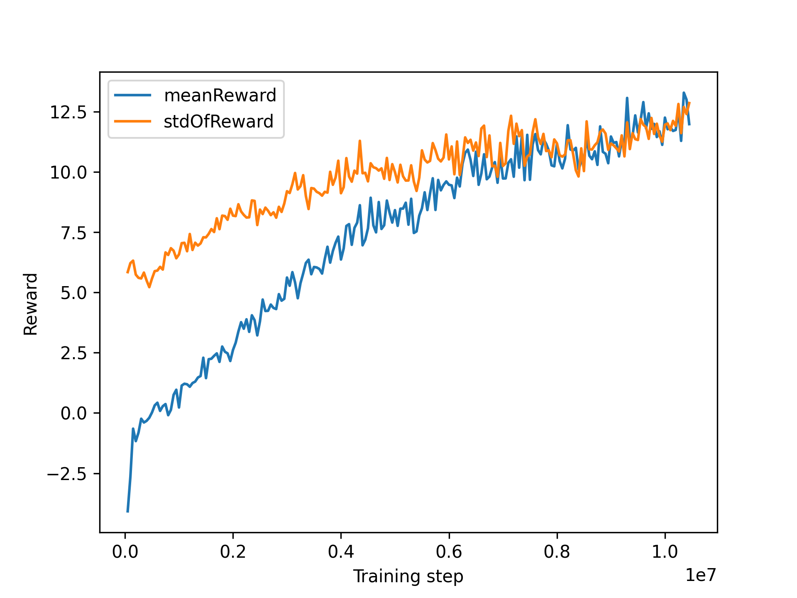

# Josh2DEndlessShooter
Another Unity game inspired by the Galaxy Shooter game, that uses visual observations to train the agent using mlagents.

# Training
## Reward system
One of the most essential part of a fast and successful training process is the reward system, which tells the agent if he's making progress or not.

## 1st try
In this game, I decided to reward my Agent for killing an enemy and anti-reward (punish) him when he touches a wall or gets killed by an enemy. He also gets a little bit punished for shooting so that he doesn't shoot all the time.

As you can see in the first graph, the mean of the agents' reward is growing, and the standard deviation also isn't something out of the ordinary.
    
    
  
## 2nd try
We can still try to improve it by adding a small passive reward that the agent gets every second so that he "knows" he's doing great by just staying alive.

This positive passive reward is having a negative effect on the agents' improvements. The mean of his rewards is in negative numbers and that doesn't seem to change anytime soon. I think it's safe to say, that the agent was better of without the passive reward.
